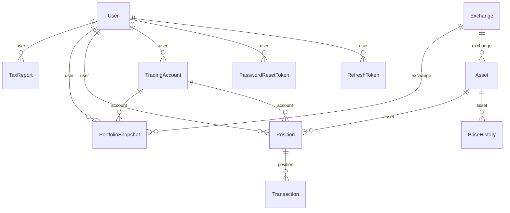

# Data model

> Generated by `scripts/context/data-model.ts` from `prisma/schema.prisma` — do not
> hand-edit. Run `yarn context:build`. Source of truth is always `prisma/schema.prisma`.

## Entity-relationship diagram

## Models

### `User` (table: `users`)

| Field | Type | Attributes |
| ----- | ---- | ---------- |
| id | `String` | @id @default(cuid()) |
| email | `String` | @unique |
| name | `String?` | — |
| passwordHash | `String` | — |
| baseCurrency | `String` | @default("AUD") |
| createdAt | `DateTime` | @default(now()) |
| updatedAt | `DateTime` | @updatedAt |
| positions | `Position[]` | — |
| tradingAccounts | `TradingAccount[]` | — |
| portfolioSnapshots | `PortfolioSnapshot[]` | — |
| refreshTokens | `RefreshToken[]` | — |
| passwordResetTokens | `PasswordResetToken[]` | — |
| taxReports | `TaxReport[]` | — |

### `RefreshToken` (table: `refresh_tokens`)

| Field | Type | Attributes |
| ----- | ---- | ---------- |
| id | `String` | @id @default(cuid()) |
| userId | `String` | — |
| token | `String` | @unique |
| expiresAt | `DateTime` | — |
| createdAt | `DateTime` | @default(now()) |
| user | `User` | @relation(fields: [userId], references: [id], onDelete: Cascade) |

### `PasswordResetToken` (table: `password_reset_tokens`)

| Field | Type | Attributes |
| ----- | ---- | ---------- |
| id | `String` | @id @default(cuid()) |
| userId | `String` | — |
| token | `String` | @unique |
| expiresAt | `DateTime` | — |
| createdAt | `DateTime` | @default(now()) |
| user | `User` | @relation(fields: [userId], references: [id], onDelete: Cascade) |

### `Exchange` (table: `exchanges`)

| Field | Type | Attributes |
| ----- | ---- | ---------- |
| id | `String` | @id @default(cuid()) |
| code | `String` | @unique |
| name | `String` | — |
| currency | `String` | @default("USD") |
| countryName | `String` | — |
| countryCode | `String` | — |
| symbolSuffix | `String?` | — |
| delay | `String?` | — |
| createdAt | `DateTime` | @default(now()) |
| updatedAt | `DateTime` | @updatedAt |
| assets | `Asset[]` | — |
| portfolioSnapshots | `PortfolioSnapshot[]` | — |

### `TradingAccount` (table: `trading_accounts`)

| Field | Type | Attributes |
| ----- | ---- | ---------- |
| id | `String` | @id @default(cuid()) |
| userId | `String` | — |
| name | `String` | — |
| status | `TradingAccountStatus` | @default(ACTIVE) |
| closedAt | `DateTime?` | — |
| createdAt | `DateTime` | @default(now()) |
| updatedAt | `DateTime` | @updatedAt |
| user | `User` | @relation(fields: [userId], references: [id], onDelete: Cascade) |
| positions | `Position[]` | — |
| portfolioSnapshots | `PortfolioSnapshot[]` | — |

Constraints: `@@unique([userId, name])`

### `Asset` (table: `assets`)

| Field | Type | Attributes |
| ----- | ---- | ---------- |
| id | `String` | @id @default(cuid()) |
| symbol | `String` | — |
| name | `String` | — |
| assetType | `AssetType` | @default(EQUITY) |
| sector | `String?` | — |
| industry | `String?` | — |
| marketCap | `Decimal?` | @db.Decimal(20, 2) |
| exchangeId | `String` | — |
| isActive | `Boolean` | @default(true) |
| createdAt | `DateTime` | @default(now()) |
| updatedAt | `DateTime` | @updatedAt |
| exchange | `Exchange` | @relation(fields: [exchangeId], references: [id]) |
| positions | `Position[]` | — |
| priceHistory | `PriceHistory[]` | — |

Constraints: `@@unique([symbol, exchangeId])`

### `PriceHistory` (table: `price_history`)

| Field | Type | Attributes |
| ----- | ---- | ---------- |
| id | `String` | @id @default(cuid()) |
| assetId | `String` | — |
| date | `DateTime` | — |
| open | `Decimal` | @db.Decimal(10, 4) |
| high | `Decimal` | @db.Decimal(10, 4) |
| low | `Decimal` | @db.Decimal(10, 4) |
| close | `Decimal` | @db.Decimal(10, 4) |
| volume | `BigInt?` | — |
| createdAt | `DateTime` | @default(now()) |
| asset | `Asset` | @relation(fields: [assetId], references: [id], onDelete: Cascade) |

Constraints: `@@unique([assetId, date])`

### `Position` (table: `positions`)

| Field | Type | Attributes |
| ----- | ---- | ---------- |
| id | `String` | @id @default(cuid()) |
| userId | `String` | — |
| assetId | `String` | — |
| accountId | `String` | — |
| openDate | `DateTime` | — |
| entryPrice | `Decimal` | @db.Decimal(10, 4) |
| quantity | `Float` | — |
| positionType | `PositionType` | @default(LONG) |
| status | `PositionStatus` | @default(OPEN) |
| totalBuyValue | `Decimal` | @db.Decimal(12, 2) |
| buyFees | `Decimal` | @default(0) @db.Decimal(8, 2) |
| closeDate | `DateTime?` | — |
| exitPrice | `Decimal?` | @db.Decimal(10, 4) |
| totalSellValue | `Decimal?` | @db.Decimal(12, 2) |
| sellFees | `Decimal?` | @default(0) @db.Decimal(8, 2) |
| stopLossPrice | `Decimal?` | @db.Decimal(10, 4) |
| takeProfitPrice | `Decimal?` | @db.Decimal(10, 4) |
| riskAmount | `Decimal?` | @db.Decimal(12, 2) |
| riskPercentage | `Decimal?` | @db.Decimal(5, 2) |
| capitalAllocated | `Decimal` | @db.Decimal(12, 2) |
| portfolioWeight | `Decimal?` | @db.Decimal(5, 2) |
| openReason | `String?` | — |
| strategy | `String?` | — |
| setupType | `String?` | — |
| timeframe | `String?` | — |
| tags | `String[]` | — |
| notes | `String?` | — |
| unrealizedPnL | `Decimal?` | @db.Decimal(12, 2) |
| realizedPnL | `Decimal?` | @db.Decimal(12, 2) |
| returnPercentage | `Decimal?` | @db.Decimal(8, 4) |
| maxDrawdownPercent | `Decimal?` | @db.Decimal(8, 4) |
| tradeGrade | `String?` | — |
| lessonsLearned | `String?` | — |
| createdAt | `DateTime` | @default(now()) |
| updatedAt | `DateTime` | @updatedAt |
| user | `User` | @relation(fields: [userId], references: [id]) |
| asset | `Asset` | @relation(fields: [assetId], references: [id]) |
| account | `TradingAccount` | @relation(fields: [accountId], references: [id], onDelete: Cascade) |
| transactions | `Transaction[]` | — |

Constraints: `@@unique([userId, assetId, openDate, entryPrice, accountId])`

### `Transaction` (table: `transactions`)

| Field | Type | Attributes |
| ----- | ---- | ---------- |
| id | `String` | @id @default(cuid()) |
| positionId | `String` | — |
| type | `TransactionType` | — |
| date | `DateTime` | — |
| quantity | `Float` | — |
| price | `Decimal` | @db.Decimal(10, 4) |
| totalValue | `Decimal` | @db.Decimal(12, 2) |
| fees | `Decimal` | @default(0) @db.Decimal(8, 2) |
| executionTime | `DateTime?` | — |
| brokerRef | `String?` | — |
| orderType | `String?` | — |
| notes | `String?` | — |
| createdAt | `DateTime` | @default(now()) |
| updatedAt | `DateTime` | @updatedAt |
| position | `Position` | @relation(fields: [positionId], references: [id], onDelete: Cascade) |

### `PortfolioSnapshot` (table: `portfolio_snapshots`)

| Field | Type | Attributes |
| ----- | ---- | ---------- |
| id | `String` | @id @default(cuid()) |
| userId | `String` | — |
| accountId | `String` | — |
| exchangeId | `String` | — |
| date | `DateTime` | — |
| totalValue | `Decimal` | @db.Decimal(15, 2) |
| totalInvested | `Decimal` | @db.Decimal(15, 2) |
| totalPnL | `Decimal` | @db.Decimal(15, 2) |
| totalReturnPct | `Decimal` | @db.Decimal(8, 4) |
| portfolioRisk | `Decimal?` | @db.Decimal(8, 4) |
| maxDrawdown | `Decimal?` | @db.Decimal(8, 4) |
| sharpeRatio | `Decimal?` | @db.Decimal(8, 4) |
| availableCash | `Decimal` | @default(0) @db.Decimal(12, 2) |
| createdAt | `DateTime` | @default(now()) |
| user | `User` | @relation(fields: [userId], references: [id]) |
| account | `TradingAccount` | @relation(fields: [accountId], references: [id], onDelete: Cascade) |
| exchange | `Exchange` | @relation(fields: [exchangeId], references: [id], onDelete: Cascade) |

Constraints: `@@unique([userId, accountId, exchangeId, date])`

### `TaxReport` (table: `tax_reports`)

| Field | Type | Attributes |
| ----- | ---- | ---------- |
| id | `String` | @id @default(cuid()) |
| userId | `String` | — |
| financialYearStartYear | `Int` | — |
| financialYearLabel | `String` | — |
| accountIds | `Json` | — |
| accountsKey | `String` | — |
| generatedAt | `DateTime` | @default(now()) |
| totalProceedsAud | `Decimal` | @db.Decimal(15, 2) |
| totalCostBaseAud | `Decimal` | @db.Decimal(15, 2) |
| totalCapitalGainGrossAud | `Decimal` | @db.Decimal(15, 2) |
| totalCapitalLossAud | `Decimal` | @db.Decimal(15, 2) |
| carriedForwardLossOpeningAud | `Decimal` | @db.Decimal(15, 2) |
| discountAppliedAud | `Decimal` | @db.Decimal(15, 2) |
| netCapitalGainAud | `Decimal` | @db.Decimal(15, 2) |
| carriedForwardLossClosingAud | `Decimal` | @db.Decimal(15, 2) |
| lineItems | `Json` | — |
| pdfData | `Bytes` | — |
| pdfSizeBytes | `Int` | — |
| createdAt | `DateTime` | @default(now()) |
| updatedAt | `DateTime` | @updatedAt |
| user | `User` | @relation(fields: [userId], references: [id], onDelete: Cascade) |

Constraints: `@@unique([userId, financialYearStartYear, accountsKey])`

### `FxRateCache` (table: `fx_rate_cache`)

| Field | Type | Attributes |
| ----- | ---- | ---------- |
| id | `String` | @id @default(cuid()) |
| currency | `String` | — |
| date | `DateTime` | — |
| rateToAud | `Decimal` | @db.Decimal(12, 6) |
| source | `String` | — |
| fetchedAt | `DateTime` | @default(now()) |

Constraints: `@@unique([currency, date])`

## Enums

- **TradingAccountStatus**: ACTIVE, CLOSED
- **AssetType**: EQUITY, ETF, CRYPTO
- **PositionType**: LONG, SHORT
- **PositionStatus**: OPEN, CLOSED, PARTIAL
- **TransactionType**: BUY, SELL, DIVIDEND, SPLIT, BONUS

## Migrations

- `20260517140750_init`
- `20260604133246_add_max_drawdown_percent`
- `20260722173150_make_open_reason_optional`
- `20260724114014_add_tax_reports`
